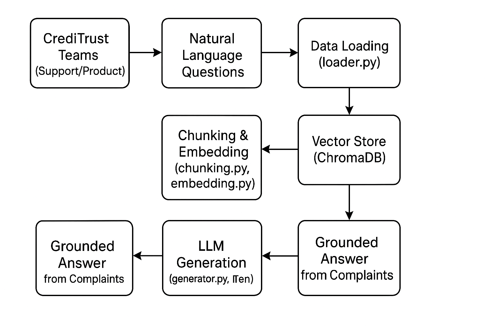

# Intelligent Complaint Analysis Chatbot (RAG-Powered)

This project delivers a Retrieval-Augmented Generation (RAG) chatbot designed for CrediTrust Financial to enable fast, insightful analysis of real customer complaints through natural language queries.

Built using large language models (LLMs), semantic search, and vector databases, the chatbot streamlines complaint review and decision-making for internal teams.

---

## Problem

CrediTrust handles millions of customer complaints spanning financial products like credit cards, loans, and Buy Now, Pay Later (BNPL). Manual analysis is:

- Time-consuming  
- Inconsistent  
- Prone to missing trends and unresolved issues  

---

## Solution

With this chatbot, internal teams can ask:

> "Why are users unhappy with BNPL?"

And instantly receive:

- Concise, grounded answers  
- Based on real complaint narratives  
- Delivered in seconds  

### Powered by:

- Text chunking and embedding  
- Semantic search via ChromaDB  
- LLM-based generation (Flan-T5)  

---

## Table of Contents

- [Problem](#problem)  
- [Solution](#solution)  
- [Visual Overview](#visual-overview)  
- [Project Status](#project-status)  
- [Project Structure](#project-structure)  
- [Final Deliverables](#final-deliverables)  
- [Tech Stack](#tech-stack)  
- [Setup Instructions](#setup-instructions)  
- [Usage Instructions](#usage-instructions)  
- [License](#license-information)  
- [Contact](#contact-information)  

---
## System Workflow
The following diagram shows the data flow and processing steps for the RAG pipeline:



---

## Project Status

* **Interim Submission (Week 6)**: Completed EDA and preprocessing, reducing 5.6M complaints to 479,110 usable entries. Resolved Google Drive data loading issues and optimized plot generation in `eda.py`. Currently debugging white plot issues.
* **Next Steps**: Finalize RAG pipeline evaluation, enhance chat interface, and scale analysis to all 5.6M complaints for final submission.

---

## Project Structure

```
credit-complaint-chatbot/
├── .github/                    # GitHub Actions workflows
│   └── workflows/ci.yml        # CI pipeline for testing
├── .gitignore
├── LICENSE
├── README.md
├── config/
│   └── settings.yaml
├── data/
│   ├── raw/
│   │   └── complaints.csv
│   └── processed/
│       ├── chunked/
│       └── filtered/
│           └── filtered_complaints.csv
├── notebooks/
│   └── eda.py
├── src/
│   ├── chunking.py
│   ├── embedding.py
│   ├── generator.py
│   ├── loader.py
│   ├── retriever.py
│   └── __init__.py
├── tests/
│   ├── test_eda.py
│   ├── test_generator.py
│   ├── test_retriever.py
│   └── __init__.py
├── vector_store/
│   ├── chroma/
│   └── embedded_ids.txt
├── app/
│   └── app.py
├── docs/
│   └── system_diagram.png
├── reports/
│   ├── interim/
│   └── final/
│       └── figures/
├── requirements.txt
└── venv/
```

---

## Final Deliverables

### Task 1: EDA and Preprocessing

* Cleaned 5.6M complaints to 479,110 usable entries (interim)
* Removed nulls, normalized narratives, calculated word stats
* Saved preprocessed `.csv` (\~1.12 GB) in `data/processed/filtered/`
* Generated EDA plots via `eda.py`
* **Final Goal**: Scale preprocessing to all 5.6M complaints

### Task 2: Chunking and Embedding

* RecursiveCharacterTextSplitter (chunk=300, overlap=50)
* Embedded with `sentence-transformers/all-MiniLM-L6-v2`
* Stored in ChromaDB with metadata
* **Final Goal**: Process and embed all complaints

### Task 3: RAG Pipeline Evaluation

| Question                                            | Answer Summary                                  | Product         |
| --------------------------------------------------- | ----------------------------------------------- | --------------- |
| Why are customers dissatisfied with credit cards?   | Hidden fees, unauthorized charges, poor support | Credit card     |
| What are common problems with Buy Now, Pay Later?   | Late fees, unclear repayment terms              | BNPL            |
| Are users experiencing delays with money transfers? | Yes, delays and failed transactions reported    | Money transfers |

* **Final Goal**: Evaluate RAG performance across all 5.6M complaints

### Task 4: Interactive Chat Interface

* `app.py` built with Gradio
* Input box, product filter, submit & clear buttons
* Tests: `test_generator.py`, `test_retriever.py`, `test_eda.py`
* **Final Goal**: Enhance UI to handle full dataset queries

---

## Tech Stack

| Component     | Library / Tool                           |
| ------------- | ---------------------------------------- |
| Data Prep     | pandas, nltk, re, matplotlib, seaborn    |
| Data Loading  | gdown, zipfile                           |
| Chunking      | LangChain RecursiveCharacterTextSplitter |
| Embedding     | sentence-transformers MiniLM-L6-v2       |
| Vector Store  | ChromaDB via LangChain                   |
| LLM Generator | transformers (Flan-T5)                   |
| Chat UI       | gradio                                   |
| Testing & CI  | pytest, GitHub Actions                   |

---

## Setup Instructions

```bash
# Clone the repository
git clone https://github.com/emegua19/credit-complaint-chatbot.git
cd credit-complaint-chatbot

# Create a virtual environment
python -m venv .venv
source .venv/bin/activate  # On Windows: .venv\Scripts\activate

# Install dependencies
pip install -r requirements.txt

# Load data (replace YOUR_FILE_ID_HERE with actual Google Drive file ID)
python src/loader.py

# Build vector store
python src/embedding.py
```

---

## Usage Instructions

```bash
python app/app.py
```

Then open your browser at [http://localhost:7860](http://localhost:7860).

Example:

> Why are users unhappy with personal loans?

---

## License Information

This project is licensed under the MIT License. See the LICENSE file for details.

---

## Contact Information

* Author: Yitbarek Geletaw
* Email: [ebnenode@gmail.com](mailto:ebnenode@gmail.com)
* 10 Academy: Week 6 AI Mastery RAG Project